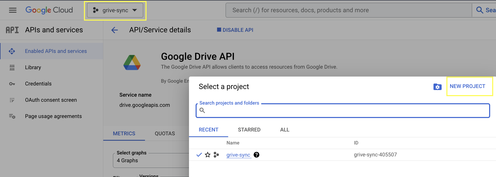
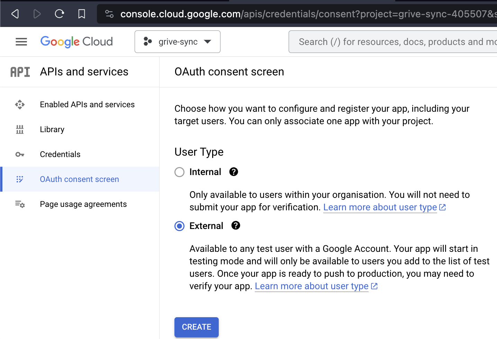
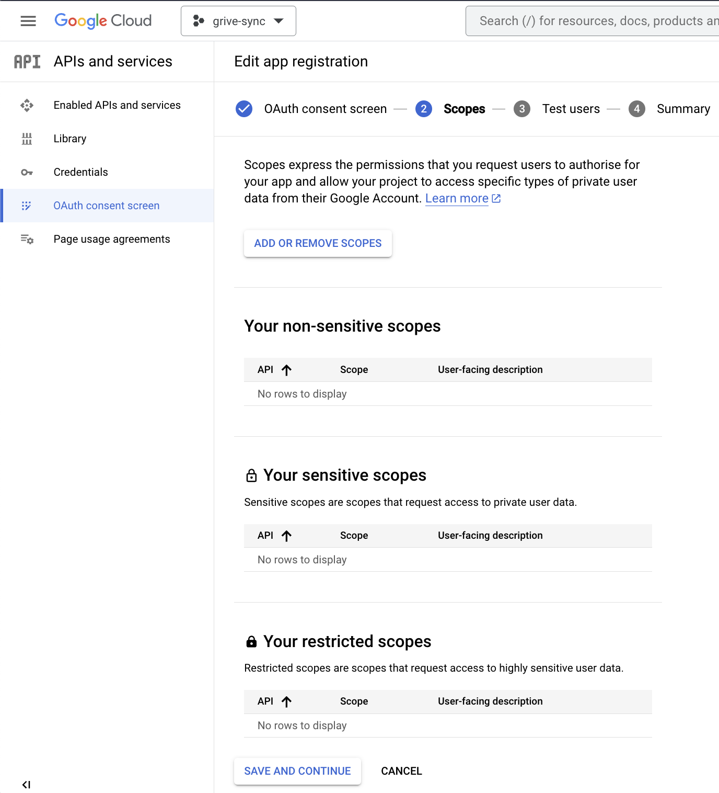
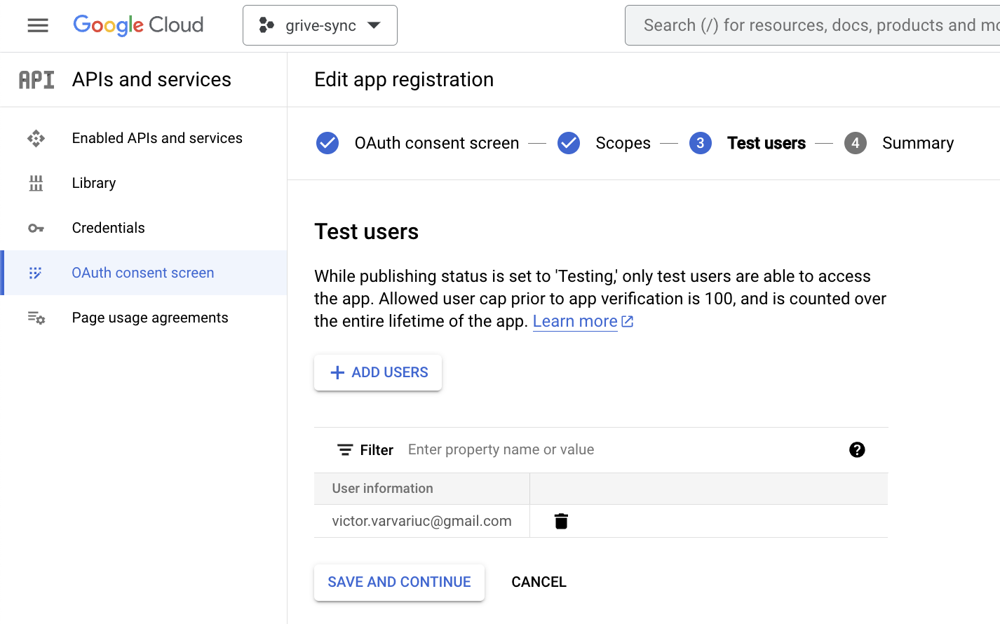
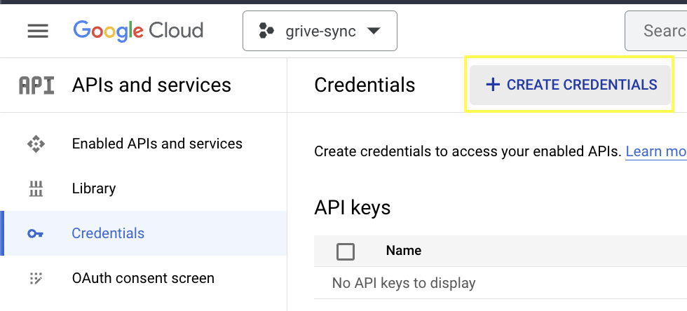
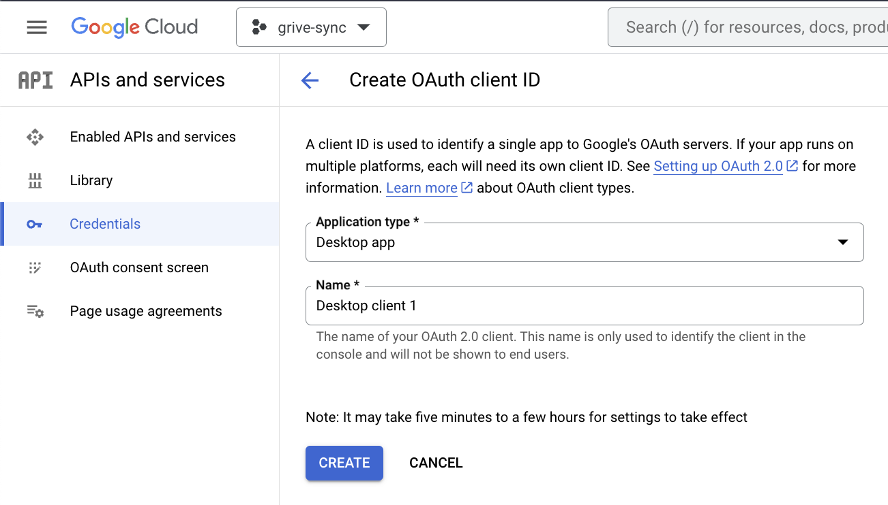
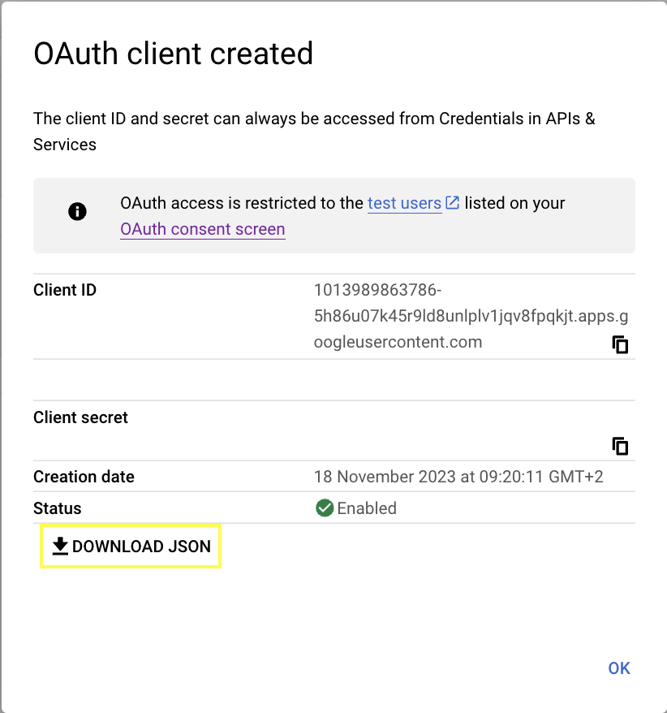
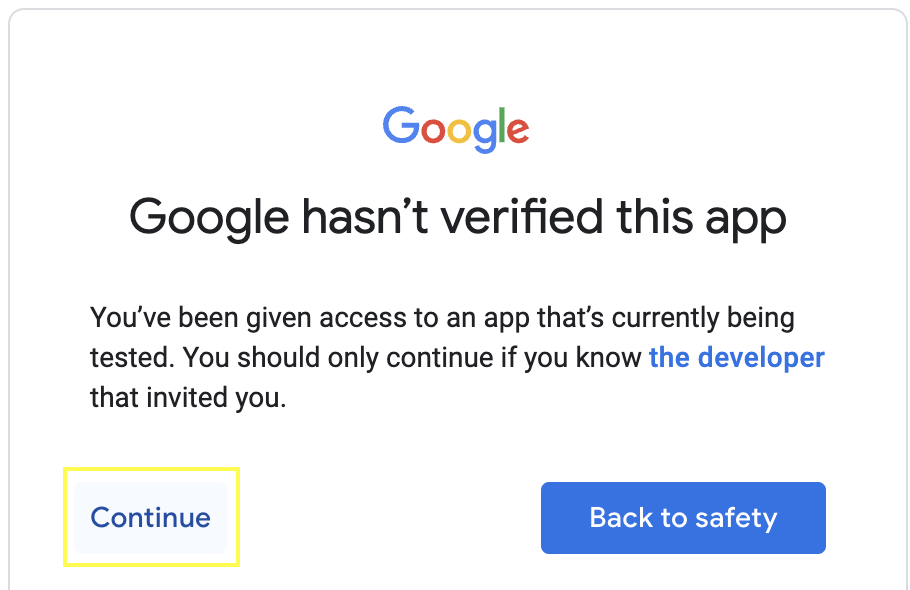
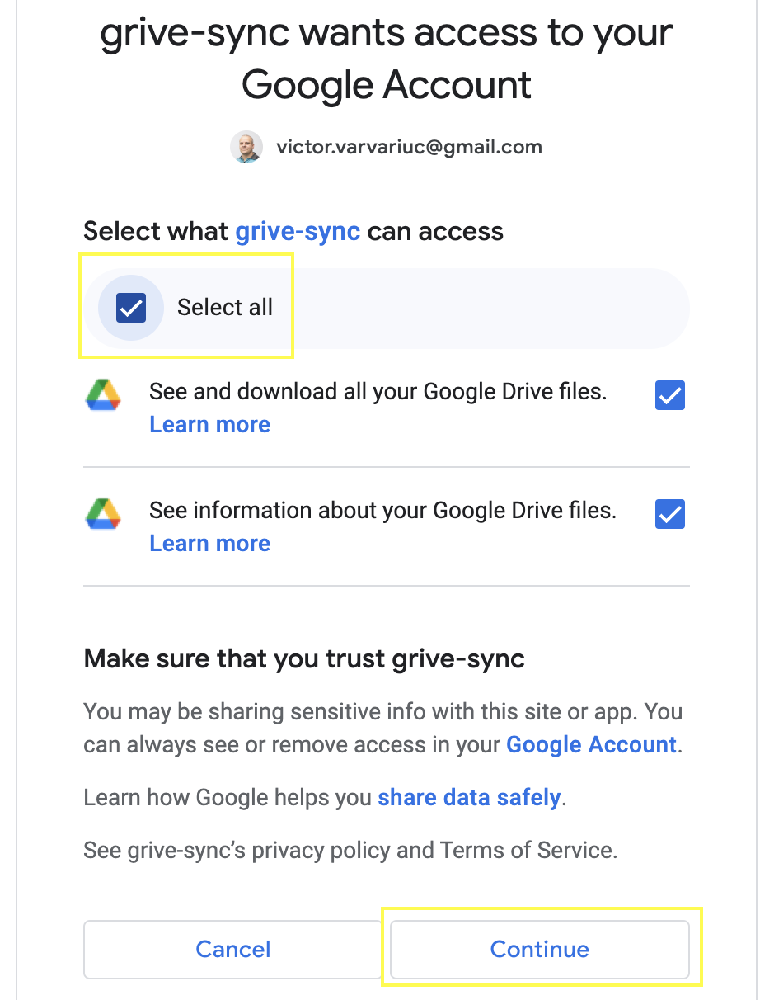

# Google Drive sync

This app downloads all Google Drive files to your computer. Unlike the official app, 
it downloads also Google Docs as MS Office documents, otherwise the docs are accessible only online
and you don't have a backup copy of them.

In order to use the script, you need to set up a Google Oauth App just for your Google user.

## Creating the app 

Go to https://console.cloud.google.com/apis/dashboard

In the top-left corner there is dropdown to select an app/project. Click on it and you will be
presented a window with the list of your projects. Click "NEW PROJECT":

Created the new project filling the required fields.

Configure Oauth consent screen:

Add the email of the user whose Google Drive you want to access/sync:

Create access credentials:

Then you will be shown the credentials:

Download  `client_secret_*.json` by clicking 'DOWNLOAD JSON' button.

Rename the file to `client_secrets.json` and place it in the project root directory. 

## Running the app

Create Python virtual enviroment, install the requirements:

    python3.11 -m venv .venv
    poetry install

Run the app:
    
    poetry run python sync.py

This will open the default browser and the Google logged in user is asked to permit the app to 
access Google Drive. The user should be test user which was configured to be used with the project
created earlier.

In case you get in the terminal this API error

    pydrive2.files.ApiRequestError: 
    <HttpError 403 when requesting https://www.googleapis.com/drive/v2/files...
    returned "Google Drive API has not been used in project ##### before or it is disabled. 
    Enable it by visiting https://console.developers.google.com/apis/api/drive.googleapis.com/overview... 
    ...

Follow the link to allow the project to use Google Drive API.

Then you will see "The authentication flow has completed." You can close the page now, the console
app has been granted access to download files from Google Drive.

Once you log in through OAuth allowing the app to access your Google Drive, the session details
are stored in `credentials.json` file. So when you run the script next time, it will reuse the session
until it expires.

To use a different browser where you are logged in to the traget account, use something like:

    BROWSER="/Applications/Brave Browser.app/Contents/MacOS/Brave Browser" poetry run python sync.py
